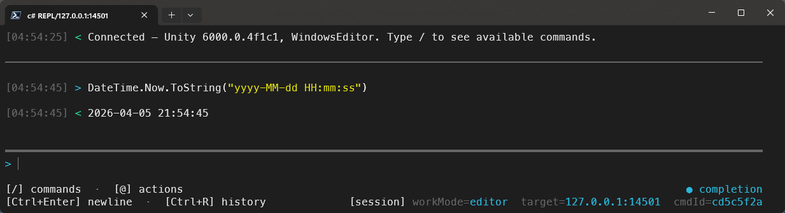
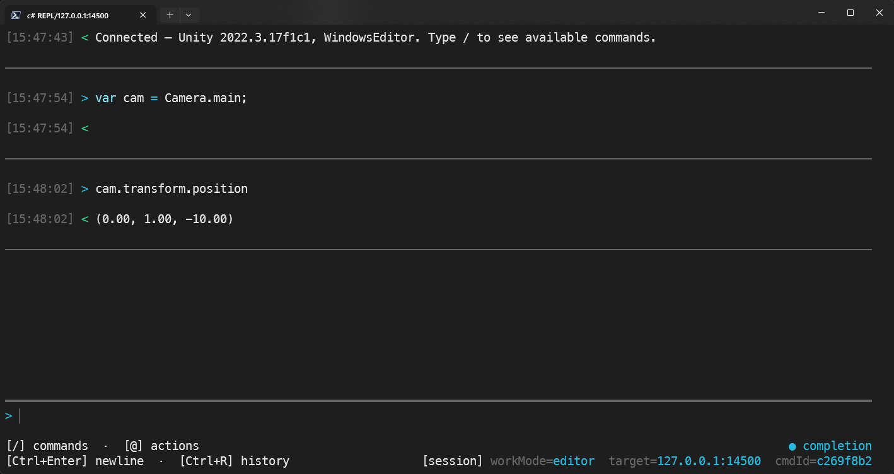
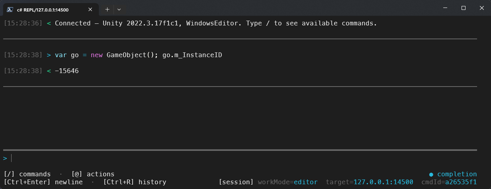
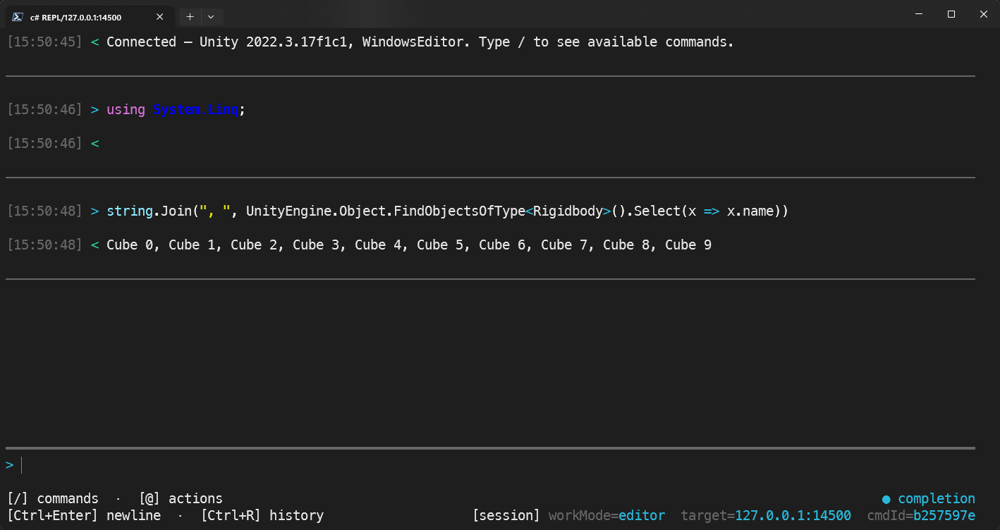
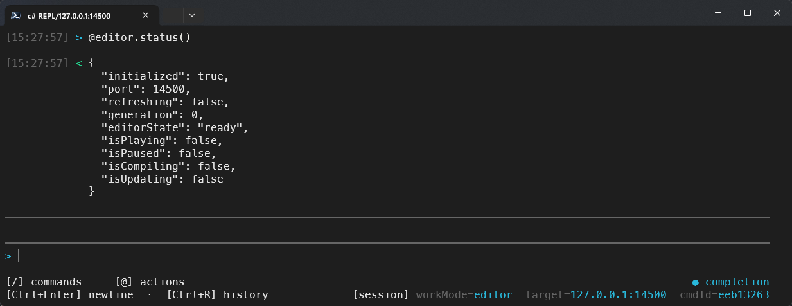

# CSharp Console

English | [中文](README_zh.md)

A Unity package that brings an interactive C# REPL, a command framework, and remote execution capabilities to the Unity Editor and Runtime, powered by Roslyn.

## Related Projects

- [unity-cli-plugin](https://github.com/niqibiao/unity-cli-plugin) — A non-interactive CLI that connects to the same CSharp Console HTTP service, designed for scripting and automation workflows.

## Features

- **Interactive REPL** — Continuous Roslyn-based script submissions with persistent session state
- **Top-level syntax** — Write statements directly, no `class` / `Main` boilerplate required
- **Semantic completion** — Member, namespace, and type completions from the Roslyn compiler
- **Command framework** — Extensible `[CommandAction]` commands with automatic parameter binding
- **Remote runtime execution** — Compile in the Editor, execute on a connected Player (IL2CPP via HybridCLR)
- **Cross-submission state** — Variables, `using` directives, and submission state persist across executions
- **Private member access** — Bypass access modifiers at compile time to inspect `private` / `protected` / `internal` members

### 1. Immediate evaluation — no class, no Main, just code

```csharp
DateTime.Now.ToString("yyyy-MM-dd HH:mm:ss")
```



### 2. Cross-submission state — variables survive across submissions

```csharp
var cam = Camera.main; cam.transform.position
```



### 3. Private member access — bypass access modifiers at compile time

```csharp
var go = GameObject.Find("Main Camera");
go.m_InstanceID
```



### 4. LINQ over live scene objects

```csharp
string.Join(", ", UnityEngine.Object.FindObjectsOfType<Rigidbody>().Select(x => x.name))
```



### 5. Command expressions — invoke server-side commands directly

```csharp
@editor.status()
```



## Installation

Add the package to your project via `Packages/manifest.json`:

```json
{
  "dependencies": {
    "com.zh1zh1.csharpconsole": "https://github.com/niqibiao/unity-csharpconsole.git"
  }
}
```

Or clone this repository and reference it as a local package:

```json
{
  "dependencies": {
    "com.zh1zh1.csharpconsole": "file:../com.zh1zh1.csharpconsole"
  }
}
```

> **Note:** Both assembly definitions have `autoReferenced: false`. If your code needs to reference this package, add `Zh1Zh1.CSharpConsole.Runtime` (or `.Editor`) to your asmdef's references explicitly.

## Quick Start

### Editor

The Editor-side service starts automatically via `[InitializeOnLoadMethod]`. No manual initialization needed.

Open the REPL from the Unity menu:

- **Console -> C#Console** — connect to the local Editor
- **Console -> RemoteC#Console** — connect to a remote Editor or Player

### Runtime

Call the following once in your initialization path to enable the remote console on a Player build:

```csharp
#if DEVELOPMENT_BUILD || UNITY_EDITOR
Zh1Zh1.CSharpConsole.RuntimeInitializer.ConsoleInitialize();
#endif
```

The runtime assembly is gated by `DEVELOPMENT_BUILD || UNITY_EDITOR`. Any code referencing `Zh1Zh1.CSharpConsole` must be wrapped in the same `#if` guard, otherwise non-development builds will fail to compile.

The runtime service listens on port `15500` by default (the editor uses `14500`). If the port is occupied, it advances to the next available one.

### HybridCLR

Runtime execution relies on HybridCLR for IL2CPP `Assembly.Load` support. If your project already has HybridCLR integrated, no additional configuration is needed.

## REPL Usage

### Starting the REPL

The recommended way is through the Unity menu entries above. You can also launch it directly:

```bash
# Auto-discover running Unity Editors and choose one
python "Editor/ExternalTool~/console-client/csharp_repl.py"

# Connect to a specific Editor
python "Editor/ExternalTool~/console-client/csharp_repl.py" --editor --ip 127.0.0.1 --port 14500

# Connect to a Runtime Player (with Editor as compile server)
python "Editor/ExternalTool~/console-client/csharp_repl.py" \
  --mode runtime --ip 127.0.0.1 --port 15500 \
  --compile-ip 127.0.0.1 --compile-port 14500
```

Python dependencies (`requests`, `prompt_toolkit`, `Pygments`) are installed automatically on first launch.

### Interaction

- **Enter** — submit the current input
- **Ctrl+Enter** — insert a newline without submitting
- **Tab** — accept the selected completion candidate
- **Ctrl+R** — reverse history search
- **Ctrl+C** — clear input (or confirm quit if input is empty)

Completion activates automatically as you type. The right side of the toolbar shows whether semantic completion is on (`●`) or off (`○`).

### Built-in Commands

| Command | Description |
| --- | --- |
| `/completion <0\|1>` | Toggle semantic completion: `0` off, `1` on |
| `/using` | Show the default `using` file path and editing instructions |
| `/define` | Show the default preprocessor defines file path and editing instructions |
| `/reload` | Reload default `using` / `define` files |
| `/reset` | Reset the REPL session |
| `/clear` | Clear the terminal |
| `/dofile <path>` | Execute a local `.cs` file |

### Command Expressions

In addition to C# code and built-in commands, the REPL supports top-level command expressions that invoke the server-side command framework directly:

```text
@project.scene.open(scenePath: "Assets/Scenes/SampleScene.unity", mode: "single")
@editor.status()
@session.inspect(sessionId: "session-1")
```

- Command expressions start with `@` at the top level and are routed to `/command` — they do not go through Roslyn compilation
- Tab completion works for command names (from the server catalog) and argument names

## Extending Commands

The command framework lets any project add custom commands without modifying the package source. Commands use an ASP.NET minimal API-style design: declare a static method with `[CommandAction]`, and the framework automatically discovers it and binds parameters from JSON.

### Step 1 — Reference the Runtime assembly

Create an asmdef (or use an existing one) that references `Zh1Zh1.CSharpConsole.Runtime`:

```json
{
  "name": "MyGame.Commands",
  "references": ["Zh1Zh1.CSharpConsole.Runtime"]
}
```

### Step 2 — Write a command handler

#### Minimal form — return `(bool, string)` tuple

The simplest way to write a command. No need to reference any framework types beyond the attribute:

```csharp
using Zh1Zh1.CSharpConsole.Service.Commands.Routing;

public static class MyCommands
{
    [CommandAction("mygame", "greet", summary: "Say hello")]
    private static (bool, string) Greet(string name = "World")
    {
        return (true, $"Hello, {name}!");
    }
}
```

Return `(true, "message")` for success, `(false, "message")` for failure.

#### Full form — return `CommandResponse` with structured data

When you need to return structured JSON data for programmatic consumption:

```csharp
using System;
using UnityEngine;
using Zh1Zh1.CSharpConsole.Service.Commands.Core;
using Zh1Zh1.CSharpConsole.Service.Commands.Routing;

public static class MyCommands
{
    [Serializable]
    private sealed class SpawnResult
    {
        public int count;
        public string prefabPath = "";
    }

    [CommandAction("mygame", "spawn", editorOnly: true, runOnMainThread: true,
        summary: "Spawn prefab instances")]
    private static CommandResponse Spawn(string prefabPath, float x = 0, float y = 0, float z = 0, int count = 1)
    {
        if (string.IsNullOrEmpty(prefabPath))
            return CommandResponseFactory.ValidationError("prefabPath is required");

        var prefab = Resources.Load<GameObject>(prefabPath);
        if (prefab == null)
            return CommandResponseFactory.ValidationError($"Prefab not found: {prefabPath}");

        for (var i = 0; i < count; i++)
            UnityEngine.Object.Instantiate(prefab, new Vector3(x, y + i * 2, z), Quaternion.identity);

        return CommandResponseFactory.Ok($"Spawned {count} instance(s)", new SpawnResult { count = count, prefabPath = prefabPath });
    }
}
```

### Step 3 — Invoke

From the REPL:

```text
@mygame.greet(name: "Unity")
@mygame.spawn(prefabPath: "Enemies/Slime", x: 10, count: 3)
```

### Parameter Binding

Handler parameters are bound automatically from JSON args by name. No DTO classes needed.

| Category | Supported types |
|----------|----------------|
| Primitives | `string`, `bool`, `int`, `long`, `short`, `byte`, `float`, `double`, `decimal`, `char` |
| Nullable | `int?`, `float?`, `Vector3?`, etc. |
| Enums | Any enum type (by name or numeric value) |
| Arrays | `int[]`, `string[]`, `FieldPair[]`, etc. |
| Structs/Classes | Any `[Serializable]` type (deserialized via `JsonUtility`) |

- **Required** parameters (no default value) produce a validation error if missing
- **Optional** parameters use C# default values: `string name = "default"`, `int count = 1`

### `[CommandAction]` Attribute Reference

```csharp
[CommandAction(
    "namespace",           // Command namespace (required)
    "action",              // Action name (required)
    editorOnly: false,     // true = unavailable on Player builds
    runOnMainThread: false,// true = dispatch to Unity main thread
    summary: "",           // Human-readable description
    supportsCliInvocation: true,
    supportsStructuredInvocation: true,
    supportsAgentInvocation: false,
    limitations: ""
)]
```

### Return Types

| Return type | When to use |
|-------------|-------------|
| `(bool, string)` | Simple commands — `(true, "msg")` for success, `(false, "msg")` for failure |
| `CommandResponse` | When you need structured `resultJson` or fine-grained control |

`CommandResponse` helpers:

| Method | Description |
|--------|-------------|
| `CommandResponseFactory.Ok(summary)` | Success with no result data |
| `CommandResponseFactory.Ok(summary, resultJson)` | Success with JSON string |
| `CommandResponseFactory.Ok<T>(summary, result)` | Success with auto-serialized result |
| `CommandResponseFactory.ValidationError(summary)` | Input validation failure |

### Configuring Command Discovery

By default the framework scans all loaded assemblies for `[CommandAction]` attributes. For large projects you can restrict scanning to specific assemblies:

```csharp
using Zh1Zh1.CSharpConsole.Service.Commands.Core;

// Call before ConsoleInitialize()
CommandDiscoveryOptions.Configure(
    new CommandDiscoveryOptions
    {
        assemblyNamePrefixes = new[] { "MyGame", "MyCompany" },
        scanReferencingAssembliesOnly = true,
        includeEditorAssemblies = false
    },
    assemblyFilter: null);

Zh1Zh1.CSharpConsole.RuntimeInitializer.ConsoleInitialize();
```

For finer-grained control, implement `ICommandAssemblyFilter` and pass it as the second argument to `Configure(...)`.

## Requirements

- **Unity** 2022.3 or later
- **Python** 3 (accessible on system `PATH`)
- **Windows Terminal** (optional — falls back to launching Python directly if unavailable)

## Third-Party Notices

This package bundles Roslyn compiler assemblies and dnlib under `Editor/Plugins/`. See [ThirdPartyNotices.md](ThirdPartyNotices.md) for full attribution and license details.

## License

[Apache License 2.0](LICENSE)
