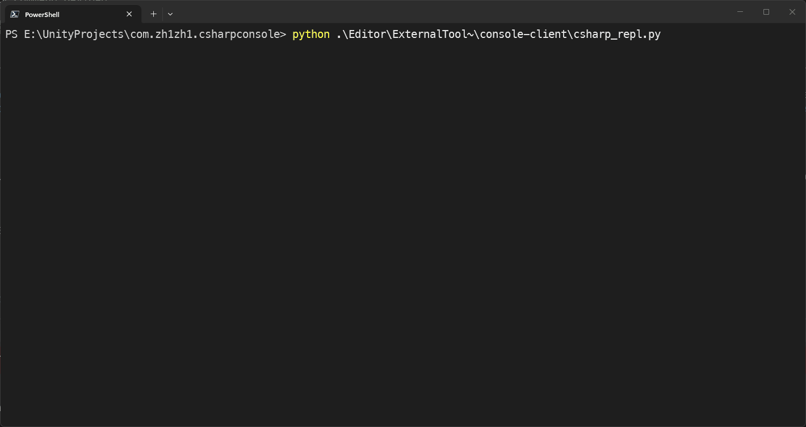

<div align="center">

# CSharp Console

**Unity 交互式 C# REPL — 基于 Roslyn**

[](LICENSE)
[](https://unity.com/)
[](https://claude.ai/code)
[](package.json)

在 Unity Editor 和 Runtime 中即时执行 C# 代码 — 无需等待编译，无需样板代码，<br/>
完整访问项目运行时状态。**Editor 零配置开箱即用，Runtime 搭配 HybridCLR 即刻运行。**

[功能特性](#功能特性) · [安装](#安装) · [快速开始](#快速开始) · [REPL 使用](#repl-使用) · [扩展命令](#扩展命令)

[English](README.md) | 中文

</div>

---

## 功能特性

### 核心能力

| | 特性 | 说明 |
|:--:|------|------|
| **>\_** | **交互式 REPL** | 基于 Roslyn 的脚本提交，会话状态持久保持 — 变量、`using` 指令、类型在多次执行间存活 |
| **#** | **Top-level 语法** | 直接写语句，不需要 `class`、`Main`、任何样板代码 |
| **@** | **命令框架** | 可扩展的 `[CommandAction]` 命令，自动 JSON 参数绑定（位置参数 & 命名参数），`/batch` 端点支持多命令批量执行 |
| **Tab** | **语义补全** | 来自 Roslyn 的实时成员、命名空间、类型补全 |
| **🔓** | **私有成员访问** | 编译阶段绕过 `private` / `protected` / `internal` 访问修饰符，深度检查对象 |
| **📡** | **远程执行** | Editor 编译，Player 执行（IL2CPP 通过 HybridCLR） |

### 效果展示



#### 即时求值 — 无需 class，无需 Main，直接写代码

```csharp
DateTime.Now.ToString("yyyy-MM-dd HH:mm:ss")
```


#### 跨提交状态保持 — 变量在后续提交中存活

```csharp
var cam = Camera.main; cam.transform.position
```


#### 私有成员访问 — 编译时绕过访问修饰符

```csharp
var go = GameObject.Find("Main Camera");
go.m_InstanceID
```


#### LINQ 查询运行中的场景对象

```csharp
string.Join(", ", UnityEngine.Object.FindObjectsOfType<Rigidbody>().Select(x => x.name))
```


#### 命令表达式 — 直接调用服务端命令

```csharp
@editor.status()
```


## 安装

通过 `Packages/manifest.json` 添加：

```json
{
  "dependencies": {
    "com.zh1zh1.csharpconsole": "https://github.com/niqibiao/unity-csharpconsole.git"
  }
}
```

或作为本地包引用：

```json
{
  "dependencies": {
    "com.zh1zh1.csharpconsole": "file:../com.zh1zh1.csharpconsole"
  }
}
```

> **注意：** 两个 asmdef 均设置了 `autoReferenced: false`。如需引用本包，请在 asmdef 中显式添加 `Zh1Zh1.CSharpConsole.Runtime`（或 `.Editor`）。

## 快速开始

### Editor — 零配置

**导入包即可使用。** Editor 侧 HTTP 服务通过 `[InitializeOnLoadMethod]` 自动启动 — 无需初始化代码，无需调整设置，无需手动配置。从 Unity 菜单打开 REPL：

| 菜单项 | 连接目标 |
|--------|----------|
| **Console > C#Console** | 本地 Editor |
| **Console > RemoteC#Console** | 远程 Editor / Player |

### Runtime — 一行代码，无需额外配置

在 Player 构建中启用远程控制台，只需一行调用：

```csharp
#if DEVELOPMENT_BUILD
Zh1Zh1.CSharpConsole.RuntimeInitializer.ConsoleInitialize();
#endif
```

Runtime 执行仅依赖 **HybridCLR** 的 `Assembly.Load` 能力实现 IL2CPP 下的程序集加载(无需任何额外配置)。

> Runtime 程序集受 `DEVELOPMENT_BUILD || UNITY_EDITOR` 条件编译约束

| | 端口 |
|--|------|
| Editor | `14500`（默认） |
| Runtime | `15500`（默认） |

端口被占用时自动递增到下一个可用端口。

## REPL 使用

### 启动

推荐通过 Unity 菜单启动，也可以直接运行：

```bash
# 自动发现运行中的 Unity Editor
python "Editor/ExternalTool~/console-client/csharp_repl.py"

# 连接指定 Editor
python "Editor/ExternalTool~/console-client/csharp_repl.py" --editor --ip 127.0.0.1 --port 14500

# 连接 Runtime Player（Editor 作为编译服务器）
python "Editor/ExternalTool~/console-client/csharp_repl.py" \
  --mode runtime --ip 127.0.0.1 --port 15500 \
  --compile-ip 127.0.0.1 --compile-port 14500
```

Python 依赖（`requests`、`prompt_toolkit`、`Pygments`）在首次启动时自动安装。

### 远程 Runtime — 可选设置

通过 **Console > RemoteC#Console** 连接 Runtime Player 时，有两个可选设置可以提高编译准确性：

| 设置 | 说明 |
|------|------|
| **Runtime Dll Path** | Player 编译后的程序集目录。编译器使用这些 DLL 替代 Editor 程序集来解析类型，确保编译结果与 Player 实际运行环境一致。推荐路径：`Library/Bee/PlayerScriptAssemblies`（执行 Player 构建后生成）。 |
| **Runtime Defines File** | `.txt` 文件，列出与 Player 构建配置一致的预处理器宏定义，确保 `#if` 指令编译时与 Player 端求值结果相同。支持每行一个宏定义或分号分隔（如 `UNITY_ANDROID;IL2CPP;DEVELOPMENT_BUILD`）。 |

两项设置持久化在 `EditorPrefs` 中，仅在 **Remote Is Editor** 未勾选时生效。留空则使用默认值（Editor 程序集和宏定义）。

### 快捷键

| 按键 | 操作 |
|------|------|
| `Enter` | 提交输入 |
| `Ctrl+Enter` | 插入换行，不提交 |
| `Tab` | 接受补全候选 |
| `Ctrl+R` | 反向历史搜索 |
| `Ctrl+C` | 清空输入（输入为空时确认退出） |

输入时自动触发补全。工具栏显示语义补全状态：开启 `●` / 关闭 `○`。

### 内置命令

| 命令 | 说明 |
|------|------|
| `/completion <0\|1>` | 切换语义补全 |
| `/using` | 显示默认 using 文件路径 |
| `/define` | 显示预处理宏文件路径 |
| `/reload` | 重新加载 using / define 文件 |
| `/reset` | 重置 REPL 会话 |
| `/clear` | 清空终端 |
| `/dofile <path>` | 执行本地 `.cs` 文件 |

### 命令表达式

REPL 支持 `@` 前缀的命令表达式，直接调用服务端命令框架 — 不经过 Roslyn 编译：

```text
@project.scene.open(scenePath: "Assets/Scenes/SampleScene.unity", mode: "single")
@editor.status()
@session.inspect(sessionId: "session-1")
```

Tab 补全支持命令名和参数名。

## 内置 Action

12 个命名空间，46 个内置命令，覆盖编辑器控制、场景操作、资产管理等常见场景。

| 命名空间 | Action | 说明 |
|----------|--------|------|
| **gameobject** | `find` | 按名称、标签或组件类型查找 GameObject |
| | `create` | 创建新 GameObject（空对象或基本体） |
| | `destroy` | 销毁 GameObject |
| | `get` | 获取 GameObject 详细信息 |
| | `modify` | 修改名称、标签、层级、激活状态或静态标记 |
| | `set_parent` | 更改 GameObject 的父级 |
| | `duplicate` | 复制 GameObject |
| **component** | `add` | 为 GameObject 添加组件 |
| | `remove` | 从 GameObject 移除组件 |
| | `get` | 获取组件的序列化字段数据 |
| | `modify` | 修改组件的序列化字段 |
| **transform** | `get` | 获取位置、旋转和缩放 |
| | `set` | 设置位置、旋转和/或缩放（本地或世界坐标） |
| **scene** | `hierarchy` | 获取完整场景层级树，可选包含组件信息 |
| **prefab** | `create` | 从场景 GameObject 创建 Prefab 资产 |
| | `instantiate` | 将 Prefab 实例化到当前场景 |
| | `unpack` | 解包 Prefab 实例 |
| **material** | `create` | 使用指定 Shader 创建新材质资产 |
| | `get` | 从资产或 Renderer 获取材质属性 |
| | `assign` | 将材质分配给 Renderer 组件 |
| **screenshot** | `scene_view` | 截取 Scene View 到图片文件 |
| | `game_view` | 截取 Game View 到图片文件 |
| **profiler** | `start` | 开始 Profiler 录制（可选深度分析） |
| | `stop` | 停止 Profiler 录制 |
| | `status` | 获取当前 Profiler 状态 |
| | `save` | 将录制的性能数据保存为 `.raw` 文件 |
| **editor** | `status` | 获取编辑器状态和播放模式信息 |
| | `playmode.status` | 获取当前播放模式状态 |
| | `playmode.enter` | 进入播放模式 |
| | `playmode.exit` | 退出播放模式 |
| | `menu.open` | 通过路径执行菜单项 |
| | `window.open` | 通过类型名打开编辑器窗口 |
| | `console.get` | 获取编辑器控制台日志 |
| | `console.clear` | 清空编辑器控制台 |
| **project** | `scene.list` | 列出项目中所有场景 |
| | `scene.open` | 通过路径打开场景 |
| | `scene.save` | 保存当前场景 |
| | `selection.get` | 获取当前编辑器选中对象 |
| | `selection.set` | 设置编辑器选中对象 |
| | `asset.list` | 按类型筛选列出资产 |
| | `asset.import` | 按路径导入资产 |
| | `asset.reimport` | 按路径重新导入资产 |
| **session** | `list` | 列出活跃的 REPL 会话 |
| | `inspect` | 检查会话状态 |
| | `reset` | 重置会话的编译器和执行器 |
| **command** | `list` | 列出所有已注册命令（内置 + 自定义） |

> 大部分 Action 仅限 Editor。`session.*` 和 `command.list` 在 Runtime 构建中同样可用。

## 扩展命令

命令框架允许任何项目在不修改本包源码的情况下添加自定义命令 — 声明一个 `[CommandAction]` 方法，框架自动处理发现、参数绑定和路由。

完整指南：**[扩展命令](Docs~/ExtendingCommands_zh.md)**

## 环境要求

| 依赖 | 版本 |
|------|------|
| Unity | 2022.3+（理论上 2019+ 可用，但未经测试） |
| Python | 3.x（系统 PATH 可访问） |
| Windows Terminal | 可选（不可用时回退到直接启动 Python） |

## 相关项目

- **[unity-cli-plugin](https://github.com/niqibiao/unity-cli-plugin)** — 非交互式 CLI，连接同一 HTTP 服务，面向脚本和自动化场景。
- **[python-prompt-toolkit](https://github.com/prompt-toolkit/python-prompt-toolkit)** — REPL 交互界面所依赖的 Python 终端 UI 库。
- **[HybridCLR](https://github.com/focus-creative-games/hybridclr)** — IL2CPP 热更新方案，Runtime 模式下的程序集加载依赖此项目。
## 第三方声明

本包在 `Editor/Plugins/` 下捆绑了 Roslyn 编译器程序集和 dnlib。完整归属和许可信息见 [ThirdPartyNotices.md](ThirdPartyNotices.md)。

## 许可证

[Apache License 2.0](LICENSE)
